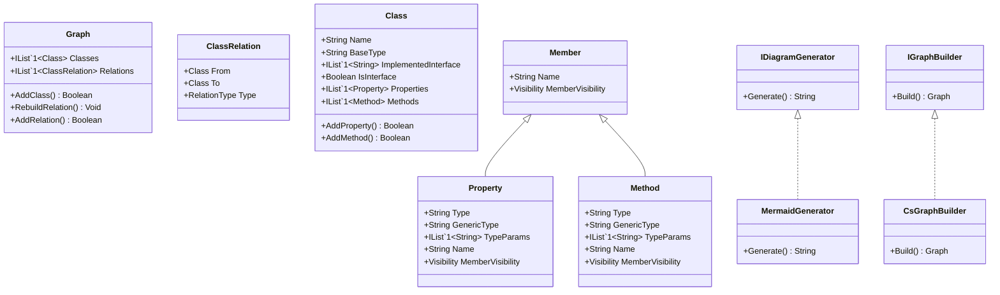

```mermaid
classDiagram
class Graph
Graph : +IList`1~Class~ Classes
Graph : +IList`1~ClassRelation~ Relations

Graph : +AddClass() Boolean
Graph : +RebuildRelation() Void
Graph : +AddRelation() Boolean


class ClassRelation
ClassRelation : +Class From
ClassRelation : +Class To
ClassRelation : +RelationType Type


class Class
Class : +String Name
Class : +String BaseType
Class : +IList`1~String~ ImplementedInterface
Class : +Boolean IsInterface
Class : +IList`1~Property~ Properties
Class : +IList`1~Method~ Methods

Class : +AddProperty() Boolean
Class : +AddMethod() Boolean


class Property
Property : +String Type
Property : +String GenericType
Property : +IList`1~String~ TypeParams
Property : +String Name
Property : +Visibility MemberVisibility


class Method
Method : +String Type
Method : +String GenericType
Method : +IList`1~String~ TypeParams
Method : +String Name
Method : +Visibility MemberVisibility


class Member
Member : +String Name
Member : +Visibility MemberVisibility


class CsGraphBuilder

CsGraphBuilder : +Build() Graph


class IDiagramGenerator

IDiagramGenerator : +Generate() String


class IGraphBuilder

IGraphBuilder : +Build() Graph


class MermaidGenerator

MermaidGenerator : +Generate() String


Member <|-- Property
Member <|-- Method
IGraphBuilder <|.. CsGraphBuilder
IDiagramGenerator <|.. MermaidGenerator

```
